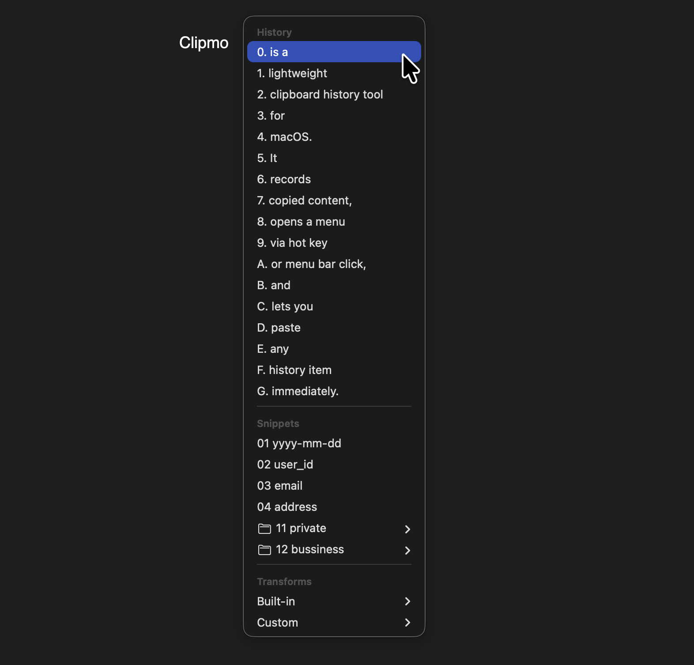

# Clipmo

Clipmo is a lightweight clipboard history tool for macOS.  
It records copied content, opens a menu via hot key or menu bar click, and lets you paste any history item immediately.

Core features include snippets, text transforms (built-in + regex-based custom), file copy support with path history, and OCR text extraction from copied image data.

Available in English and Japanese.

Detailed documentation below is in Japanese.

---

Clipmo は macOS 向けのクリップボード履歴ツールです。  
コピーしたものを履歴として残し、ホットキーまたはメニューバーアイコンから一覧を開いて、選んでそのまま貼り付けられます。



## ダウンロード

最新バージョンは[リリースページ](../../releases/latest)からダウンロードできます。

## 最初に知ってほしいこと

- Clipmo は、コピーした内容を自動で履歴に残します
- ホットキーまたはメニューバーアイコンのクリックで、履歴メニューを開けます
- 履歴を選ぶと、その内容がクリップボードに入り、そのまま貼り付けられます
- 既定のホットキーは `Control + Option + V` です
- 自動貼り付けを行うため、初回はアクセシビリティ権限が必要です

## 基本機能に加えてできること

- よく使う定型文をスニペットとして登録し、いつでも貼り付けられます
- 現在のクリップボード上の文字列に対して、正規表現置換を実行できます
- 組み込み変換として、Unicode コードポイント表示、UTF-8 バイト列表示、URL エンコード、URL デコードを使えます
- Finder でファイルをコピーしたときは、ファイルとして貼れる履歴に加えて、フルパス文字列の履歴も追加されます
- 画像データをコピーしたときは、画像そのものに加えて、OCR で読み取った文字列も履歴に追加されます

## 操作の広げ方

- ホットキーを押すたびに開くメニューを切り替える設定ができます
- たとえば `all -> history -> customtransforms` のようにローテーションさせられます
- 履歴やスニペットを `Shift + クリック` すると、貼り付けずにクリップボードへ入れるだけにできます
- 履歴やスニペットを `Option + クリック` すると、対応するファイルを Finder で開けます
- 履歴、スニペット、変換を `Command + クリック` すると、通常動作のあと同じメニューを再表示して連続操作できます
- これらの modifier キーは設定で変更できます

## データの管理

Clipmo の設定やデータは、アプリ内ではなくファイルとフォルダで管理します。

- 初回起動時に `~/.clipmo` が作られます
- 履歴は `history/`
- スニペットは `snippets/`
- カスタム変換は `transforms/`
- 設定は `clipmo.conf`

Clipmo 自体には編集 UI はありません。  
その代わり、Finder や一般的なテキストエディタから自由に編集できます。

また、`history`、`snippets`、`transforms` の保存場所は設定で変更できます。

- Dropbox などのクラウドストレージへ向ければ、複数の Mac で共有できます
- Time Machine のようなバックアップ対象に含めることも、逆に除外することも簡単です

## 設定

設定は `~/.clipmo/clipmo.conf` で行います。  
形式は TOML です。コメントも書けます。

```toml
maxHistoryCount = 100
menuPreviewMaxWidth = 420
historyItemsPerMenuLevel = 20
hotKeyMenuRotation = ["all"]
ocrLanguages = ["ja-JP", "en-US"]

[hotKey]
key = "v"
modifiers = ["option", "control"]

[itemSelectionModifiers]
copyOnly = "shift"
revealInFinder = "option"
repeatSelection = "command"

[directories]
history = "~/Dropbox/Clipmo/history"
snippets = "~/Dropbox/Clipmo/snippets"
transforms = "~/Dropbox/Clipmo/transforms"

[historyRetention]
unit = "days"
value = 30
```

### `hotKey`

グローバルホットキーの設定です。

- `key`
  - 押すキーです
  - 使える値:
    - 英字 `a` から `z`
    - 数字 `0` から `9`
    - `space`, `return`, `tab`, `escape`, `delete`
    - `left`, `right`, `up`, `down`
    - `f1` から `f12`
  - 省略時は `v`
- `modifiers`
  - 一緒に押す修飾キーです
  - 使える値: `command`, `option`, `control`, `shift`
  - 配列で指定します
  - 例: `["option", "control"]`
  - 省略時は `["option", "control"]`

### `itemSelectionModifiers`

履歴、スニペット、変換をクリックしたときの modifier 動作です。

- `copyOnly`
  - 貼り付けずにクリップボードへ入れるだけの動作
  - 既定値は `shift`
- `revealInFinder`
  - Finder で対応ファイルを開く動作
  - 既定値は `option`
- `repeatSelection`
  - 通常動作のあと同じメニューを再表示する連続操作モード
  - 既定値は `command`
- 使える値はすべて `command`, `option`, `control`, `shift`
- 省略時は既定値を使います

### `ocrLanguages`

OCR で優先する言語です。

- 例: `["ja-JP", "en-US"]`
- 省略時は macOS の優先言語設定を使います

### `directories`

`history`、`snippets`、`transforms` の保存場所を変えられます。

- `history`
  - 履歴フォルダの場所
- `snippets`
  - スニペットフォルダの場所
- `transforms`
  - カスタム変換フォルダの場所
- `~/...` の形式が使えます
- 相対パスは `~/.clipmo/` からの相対として扱います
- 省略時はそれぞれ `~/.clipmo/history`、`~/.clipmo/snippets`、`~/.clipmo/transforms` を使います

### `hotKeyMenuRotation`

ホットキーで開くメニューの順番です。

- 使える値:
  - `all`
  - `history`
  - `snippets`
  - `snippet0`, `snippet1`, ...
  - `transforms`
  - `builtintransforms`
  - `customtransforms`
- 例: `["all", "snippet0", "customtransforms"]`
- 省略時は `["all"]`

### `historyRetention`

履歴の保存期間です。

- `unit`
  - `hours`
  - `days`
  - `unlimited`
- `value`
  - `hours` または `days` のときに使う数値
- 例:

```toml
[historyRetention]
unit = "days"
value = 30
```

- 省略時は無期限です

### `maxHistoryCount`

保持する履歴件数の上限です。

- 数値で指定します
- 省略時は `100`

### `menuPreviewMaxWidth`

履歴プレビューの最大幅です。

- 数値で指定します
- 単位はピクセル相当です
- 省略時は `420`

### `historyItemsPerMenuLevel`

履歴メニューの 1 階層に直接表示する件数です。

- 数値で指定します
- 新しい履歴からこの件数だけ直接表示します
- それより古い履歴は同じ件数ずつ別メニューに分かれます
- 省略時は `20`

## スニペット

スニペットは `~/.clipmo/snippets` にファイルを置くだけで使えます。

- フォルダ構成はそのままメニューに反映されます
- ファイル名昇順で並びます
- メニュー上では拡張子を隠して表示します

### 通常スニペットの作り方

例:

`~/.clipmo/snippets/signature.txt`

```text
よろしくお願いします。
```

これでメニューに `signature` が現れ、選ぶとその文章を貼り付けられます。

### 動的スニペットの作り方

`.clipmo-snippet` 拡張子のファイルは、選択時に特殊書式を展開します。

例:

`~/.clipmo/snippets/today.clipmo-snippet`

```text
[[clipmo:date:yyyyMMdd]]
```

これを選ぶと、その日の日付へ展開されます。

本文の途中にも書けます。

```text
release_[[clipmo:date:yyyyMMdd]]
```

## 変換

変換は、現在のクリップボードに入っている文字列に対して実行します。  
ファイルや画像に対しては使いません。

### 組み込み変換

- `Unicodeコードポイント`
  - 文字列を `U+3042` のような Unicode コードポイント表記に変換します
- `UTF-8バイト列`
  - 文字列を UTF-8 の 16 進バイト列に変換します
- `URLエンコード`
  - URL 用の percent-encoding を行います
- `URLデコード`
  - percent-encoding された文字列を元に戻します

### 正規表現置換の作り方

`~/.clipmo/transforms` に `*.json` を置くと、カスタム変換として使えます。

例:

`~/.clipmo/transforms/zero-pad.json`

```json
{
  "pattern": "^([0-9]{1})$",
  "replacement": "00$1"
}
```

この例では、1 桁の数字を 2 桁ゼロ埋めします。

オプションも指定できます。

```json
{
  "pattern": "^([0-9]{1})$",
  "replacement": "00$1",
  "options": {
    "caseInsensitive": 0,
    "allowCommentsAndWhitespace": 0,
    "ignoreMetacharacters": 0,
    "dotMatchesLineSeparators": 0,
    "anchorsMatchLines": 0,
    "useUnixLineSeparators": 0,
    "useUnicodeWordBoundaries": 0
  }
}
```

補足:

- `replacement` でタブを入れたいときは `\t`
- `replacement` で改行を入れたいときは `\n`
- `pattern` で正規表現の `\t` を書きたいときは `\\t`

## 補足

- 画像 OCR は、画像ファイルを Finder でコピーしたときではなく、画像データそのものをコピーしたときだけ動きます
- OCR に成功したときは `OCRしました` と表示します
- ブラウザなどのパスワード入力欄では、macOS 側の制限でホットキーが効かないことがあります

## 開発者向け

ビルド方法:

```bash
./scripts/build-app.sh
```

生成されるアプリ:

- `build/Clipmo.app`
